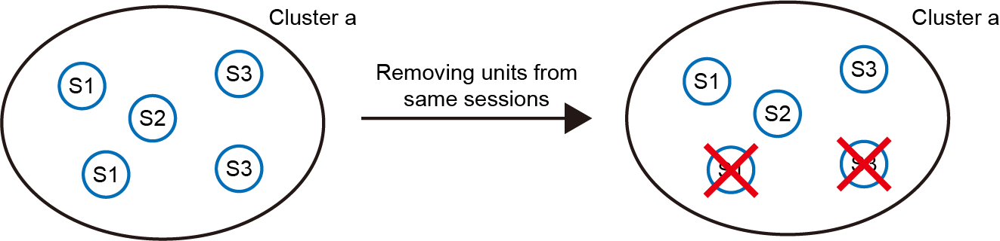
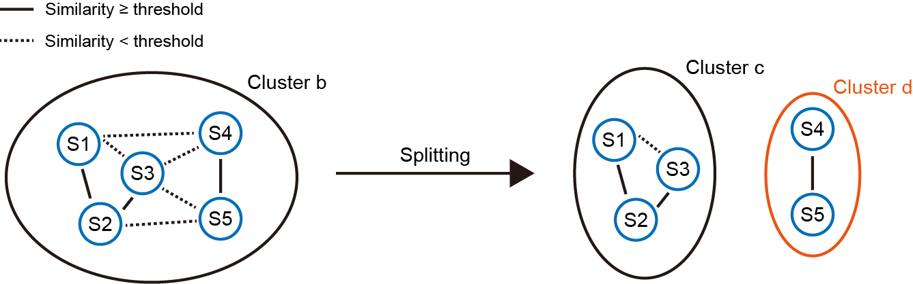

Auto curation
===================

Auto curation is the last step in the pipeline. It is designed to refine the clustering results and control the false positive rate. Two steps are involved: 

(1) Removal of units from the same session within a cluster.

(2) Splitting of clusters based on the LDA-derived threshold.

Step 1: Removal of units from the same session
-------------------------------------------------------------------

|

As HDBSCAN clustering assumes that units within a cluster originate from distinct sessions (max_cluster_size = number of sessions, see :ref:`Clustering <HDBSCAN_label>`), it is necessary to ensure that this assumption holds true. However, sometimes the clustering results violate this assumption, leading to clusters containing units from the same session (left panel). To address this, we remove the units with the lowest mean similarity to other units in the cluster (right panel). This step ensures that each cluster contains only one unit per session. The number of matched pairs removed in this step ranges from 1% to 10%.

.. _auto_curation_step2_label:

Step 2: Splitting of clusters based on the LDA-derived threshold
-------------------------------------------------------------------

|

Although the density-based clustering algorithm finds relatively "dense" clusters, it does not guarantee that units within a cluster are similar enough to each other. We leverage the LDA-derived similarity threshold to solve this issue. As shown in the left panel, some units are similar to each other (solid lines, similarity ≥ threshold), while others are not (dashed lines). It forms an undirected graph, and our goal is to find the connected components (units connected with solid lines). As in this case, two connected components are found (right panel). The original cluster b is now splitted into two subclusters (cluster c and cluster d).

Step 2 curation is optional and can be skipped by editting the ``settings.json`` file (see :ref:`Change default settings <auto_split_label>`). Note that this step won't kill many matched pairs. It removes less than 1% matched pairs in most datasets.

