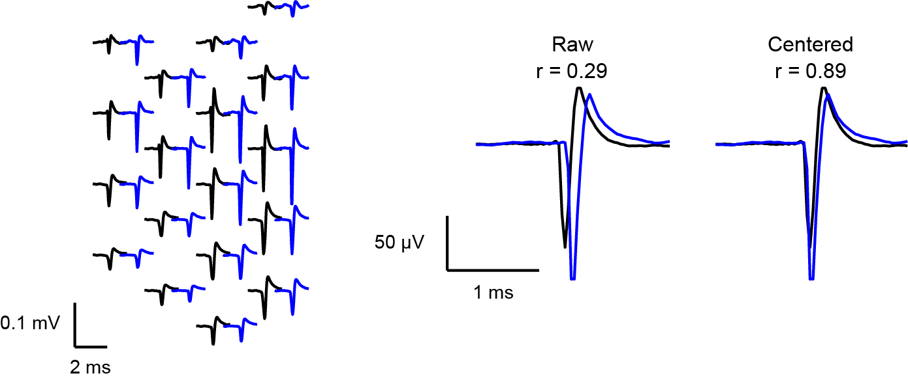

Center waveforms
=========================

|

Spike sorting algorithms like Kilosort may not perfectly center waveforms on their trough. This misaligns waveforms, significantly reducing waveform similarity and potentially affecting Kilomatch's performance. As illustrated in the figure above, two units from Kilosort, despite having intrinsically similar waveforms, show a Pearson correlation of only 0.29 when misaligned, compared to 0.89 when correctly centered.

To avoid this issue, it is recommended to center the waveforms before entering Kilomatch. If waveforms are not pre-centered, Kilomatch can automatically align them to the trough of the waveform on the peak channel. Be aware that this process involves cropping and nearest-neighbor extrapolation at the borders. Note that it cannot deal with the positive spikes. Please ensure that the positive spikes are not included when centering the waveforms.

Refer to :ref:`Change default settings <centering_waveforms_setting_label>` for instructions on configuring waveform centering.

