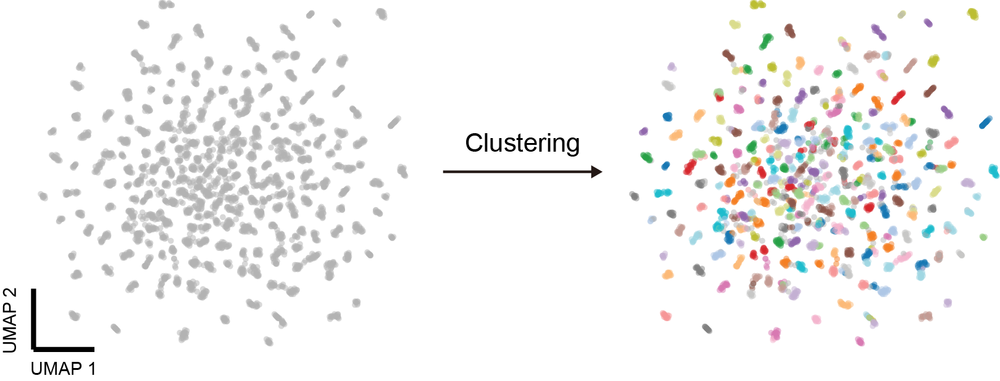
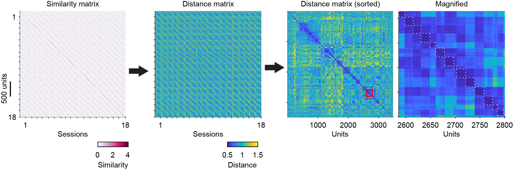
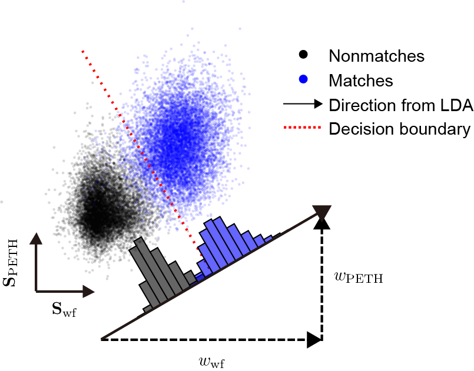
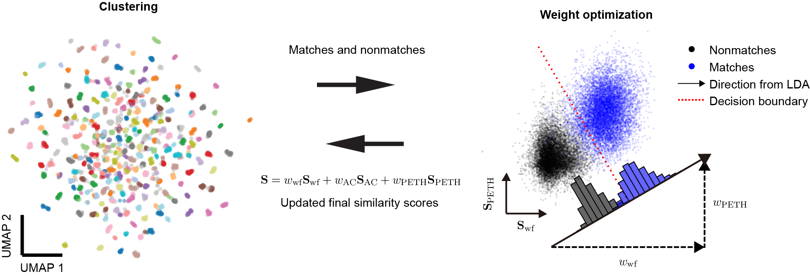

Clustering
============

How to track neurons across days
-----------------------------------

Now we have the methods to compute the similarity between any two units (see :doc:`Features <Features>` and :doc:`Motion correction <Motion_correction>`). Then, how to use it to track neurons across sessions? 

Traditionally, scientists focused on finding the matches between 2 sessions. What they did is basically a binary classification problem, that is, classify all the unit pairs from 2 sessions into "matched" class or "unmatched" class. The selected features and classification algorithm varied across different algorithm. However, it doesn't solve the tracking algorithm. In tracking problem, it searches for "chains" (composed of multiple units from different sessions) instead of "matches" (composed of 2 units). It remains a unsolved and difficult problem to turn the "matches" into "chains" in an effective way.

|

Here, we look at the tracking problem from another perspective. We formulated the problem as a clustering task, treating units from different sessions as points in a high-dimensional space where units from the same neuron cluster together. The unsupervised UMAP visualizes all units in a 2D space (left panel). Now our goal is to group the units from the same neurons with a proper clustering algorithm (right panel, the clustering result is color-coded). Common clustering algorithms such as k-means, Gaussian mixture models, and DBSCAN are unsuitable for this task due to unknown cluster counts, small transient neuron clusters, and non-Gaussian data distributions. However, HDBSCAN worked for the tracking problem despite all these difficulties.

.. _HDBSCAN_label:

HDBSCAN
------------

HDBSCAN is an unsupervised clustering algorithm extending DBSCAN by
converting it into a hierarchical clustering algorithm. We utilized the
Python implementation at https://github.com/scikit-learn-contrib/hdbscan. Parameters in this paper were:
``min_cluster_size`` = 2, ``max_cluster_size`` = maximum session number and
``min_samples`` = 1. The input distance matrix :math:`\mathbf{D}` is defined in
the form:

.. math::

    \begin{aligned}
    \mathbf{D}_{i,j} &={\begin{cases}0&{\text{if }}i=j,\\\frac{1}{1+\tanh(\mathbf{S}_{i,j})}&{\text{else }}\end{cases}}
    \end{aligned}

.

HDBSCAN begins by transforming similarity scores (1st panel) into distances (2nd panel) and constructing a robust single-linkage tree, which reorders units such that similar units are spatially close (3rd and 4th panels). Then it extracts the clusters from the tree based on the maximum stability of clusters (the white dashed boxes indicate clusters). Units from the same neuron form distinct blocks in the distance matrix (4th panel) and distinct clusters in UMAP projections, validating the clustering approach.

.. _weight_optimization_label:

Weight optimization
-----------------------

Another problem is the optimization of the weights of different metrics. Different metrics are not equally informative, and the importance of a certain feature might vary with animals, brain regions, electrode types and others. Therefore, it is crucial to determine the best weights for each dataset. With equally set weights initially (see :ref:`weighted similarity <weighted_similarity_label>` for details), we can get the matches and nonmatches by HDBSCAN. The matches and nonmatches form distinct clusters (blue points and black points) when plotting the similarity scores in a 2-dimensional subspace. 

To estimate the importance / weights of different metrics, we resort to linear discriminant analysis (LDA), which quickly finds a one-dimensional projection maximizing the separation between the matches and nonmatches. Because of disproportionately more unmatched pairs than matched pairs, only spatially close unit pairs (within 100 μm in :math:`y` position by default) were included. This analysis was performed using MATLAB's function ``fitcdiscr``. The LDA model assumes that similarity scores for matched and unmatched pairs follow multivariate Gaussian distributions with identical covariance matrices. The model generates a hyperplane that maximizes separation between these two classes. The coefficients of the hyperplane's normal vector served as weights to generate a single, optimized similarity score, reflecting the relative importance of each feature. Projecting data onto this one-dimensional vector maximized the discrimination between matches and non-matches. We take the weights of different metrics on that projection as the optimized weights for computing the final similarity scores. Last, the updated similarity matrix provided by LDA will be used in the next round of clustering. Additionally, the hyperplane defines a similarity threshold (the red dased line), which is useful in the later :ref:`curation step <auto_curation_step2_label>`.

The initial clustering rounds identifies matches used for motion correction. To minimize false positives, these matches must also satisfy the LDA decision boundary. The final clustering round generates the output results, followed by the auto curation step.

.. _iterative_clustering_algorithm_label:

Iterative clustering algorithm
---------------------------------

Recognizing that HDBSCAN benefits from refined similarity scores and LDA from accurate clustering for weight optimization, we created an iterative algorithm for clustering and feature selection. The weights are set equally at the beginning, and the clustering process and weight optimization process are performed alternatively. This iterative process converges reliably, producing consistent final clustering results. By default, 10 iterations will be done (see :ref:`here <n_iter_setting_label>` for how to change the number of iteration). 

DANT executes this iterative clustering multiple times --- before and after motion correction (see :ref:`iterative motion correction <iterative_motion_correction_label>` for details). After motion correction, the weight for waveform feature will increase in nearly all datasets, highlighting the improved reliability of motion-corrected waveforms in neuron tracking. 

