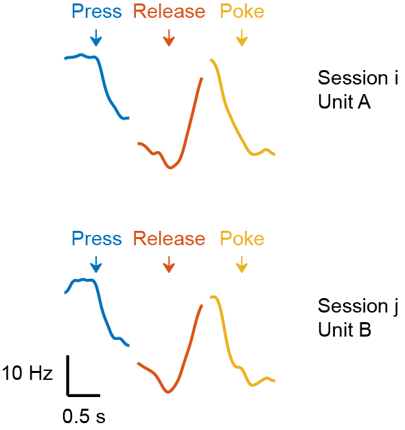
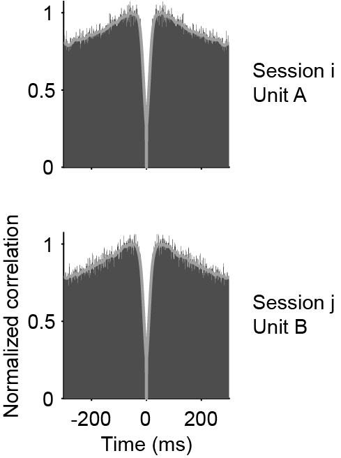
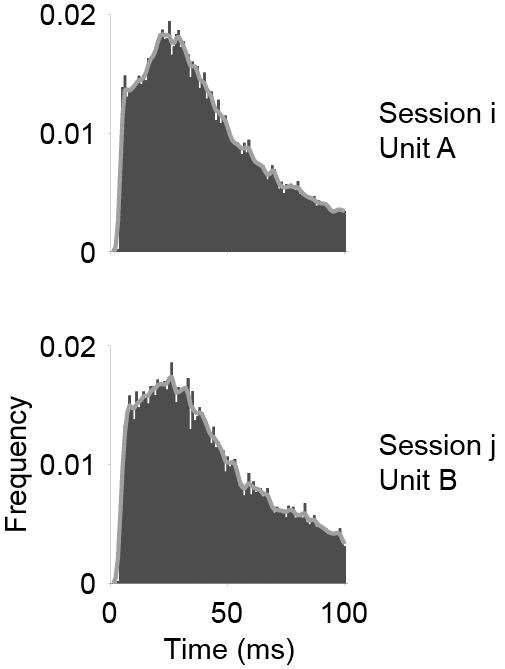
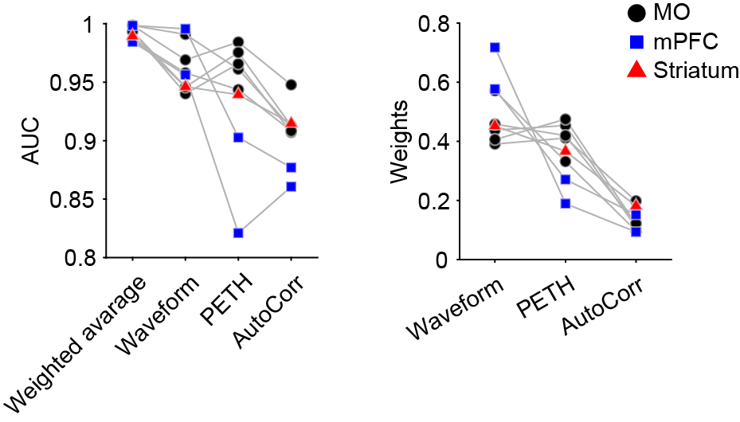

Features
===========

To compare the similarity between 2 units, we pick some informative features that help discriminate matched pairs and unmatched pairs. These features include:

- Waveform

- Peri-event time histogram (PETH)

- Autocorrelogram

- Inter-spike interval histogram (ISI)

.. _waveform_similarity_label:

Waveform
-----------

.. image:: ./images/WaveformSimilarity.png
    :width: 60%
    :align: center

We compute the Pearson's correlation coefficient between raw waveforms or motion-corrected waveforms :math:`\mathbf{W}` from the :math:`n` nearest channels (:math:`n` = 38 by default, see :ref:`Change default settings <waveform_correction_n_nearest_channels_label>`) and Fisher's z transform is applied:

.. math::
    Z_{i,j} =
    \tanh^{-1}(\operatorname{corrcoef}(\mathbf{W}^{i}_{\mathcal{C_i}},
    \mathbf{W}^{j}_{\mathcal{C_i}}))

and

.. math::
    Z_{j,i} =
    \tanh^{-1}(\operatorname{corrcoef}(\mathbf{W}^{i}_{\mathcal{C_j}},
    \mathbf{W}^{j}_{\mathcal{C_j}}))

,

where :math:`\mathcal{C_i}` indexes of the :math:`n` nearest channels from the peak channel (the channel with maximum amplitude) of unit :math:`i`. :math:`\mathbf{W}^{j}_{\mathcal{C_i}}` is the waveforms of unit :math:`j` from the channel indices :math:`\mathcal{C_i}`. As different units have different peak channels, :math:`Z_{i,j}` may not be equal :math:`Z_{j,i}`. To make the similarity score symmetric, the final similarity score is computed via

.. math::
    \mathbf{S}_{\text{wf}}^{i,j} = \operatorname{max}(Z_{i,j}, Z_{j,i})

.

.. _PETH_feature_label:

Peri-event time histogram (PETH)
-------------------------------------

The PETH features are precomputed during data processing. It is a vector reflecting the functional properties of each unit. As shown in the figure, we combined three different PETHs (lever-press, lever-release, poke, see the `paper <https://www.jneurosci.org/content/45/16/e1820242025>`_ for the details about the task) to make the PETH feature vector. Then, The PETH similarity score between unit :math:`i` and unit :math:`j` is

.. math::
    \mathbf{S}^{i,j}_{\text{PETH}} = \tanh^{-1}(\operatorname{corrcoef}(\text{PETH}_i, \text{PETH}_j)

.

.. _Autocorrelogram_feature_label:

Autocorrelogram
-------------------

We compute the autocorrelogram for each unit within a maximum lag of 300 ms, using a bin width of 1 ms. The lag and bin width can be adjested in ``settings.json`` (see :ref:`Change default settings <autocorr_setting_label>`).The distribution is then smoothed by a Gaussian kernel (:math:`\sigma` = 5 ms), and zeroed at lag 0. The autocorrelogram similarity score between unit :math:`i` and unit :math:`j` is

.. math::
    \mathbf{S}^{i,j}_{\text{AC}} = \tanh^{-1}(\operatorname{corrcoef}(\text{AC}_i, \text{AC}_j))

.

Note that this feature basically encode the same thing as Inter-spike interval histogram (ISI). Don't use these two features as it will cause collinearity and impair the LDA performance.

Inter-spike interval histogram (ISI)
-----------------------------------------

This feature is not used in DANT by default because it basically encode the same thing as autocorrelogram. Use the two features together will cause collinearity and impair the LDA performance. Nevertheless, we still put it here as an feature option. We compute the ISI for each unit within a window of 100 ms, using a bin width of 1 ms by default. The lag and bin width can be adjested in ``settings.json`` (see :ref:`Change default settings <ISI_setting_label>`).The distribution is then smoothed by a Gaussian kernel (:math:`\sigma` = 1 ms). The ISI similarity score between unit :math:`i` and unit :math:`j` is

.. math::
    \mathbf{S}^{i,j}_{\text{ISI}} = \tanh^{-1}(\operatorname{corrcoef}(\text{ISI}_i, \text{ISI}_j))

.

How to choose the features
--------------------------------

|

Different features are not equally informative about the unit identity. We tested the importance of each feature by calculating the AUC (area under the ROC curve) between matched and unmatched pairs. The weights derived from LDA (see :ref:`Clustering <weight_optimization_label>`) also reflected the power of discrimination. 
In our datasets, the waveform feature played the most important role in tracking neurons, followed by PETH feature. The autocorrelogram feature is the least informative (similar to ISI feature, data not shown). Note that the PETH feature depends on many things such as the task and the brain regions, it is not guarenteed to help tracking neurons. As in this case, the mPFC datasets showed a less powerful PETH feature because their modulation in this task is weaker than the motor cortex. 

.. _weighted_similarity_label:

Weighted similarity
-----------------------

As the clustering algorithm required, we should combine the different similarity scores into one single value reflecting the similarity / distance between any two units. 

The final similarity score is the weighted average of :math:`\mathbf{S}_{\text{wf}}`, :math:`\mathbf{S}_{\text{AC}}` and :math:`\mathbf{S}_{\text{PETH}}` via:

.. math::
    \mathbf{S}=w_{\text{wf}}\mathbf{S}_{\text{wf}}+w_{\text{AC}}\mathbf{S}_{\text{AC}}+w_{\text{PETH}}\mathbf{S}_{\text{PETH}}

and 

.. math::
    w_{\text{wf}} + w_{\text{AC}} + w_{\text{PETH}} = 1

,

where :math:`w_{\text{wf}}`, :math:`w_{\text{AC}}` and :math:`w_{\text{PETH}}` are the weights for the waveform, autocorrelogram and PETH similarity scores, respectively. These weights were initialized equally and optimized iteratively (see :ref:`Weight optimization <weight_optimization_label>`). PETH features may be excluded in some studies, reducing the equation to:

.. math::
    \mathbf{S}=w_{\text{wf}}\mathbf{S}_{\text{wf}}+w_{\text{AC}}\mathbf{S}_{\text{AC}}
    
and

.. math::
    w_{\text{wf}} + w_{\text{AC}} = 1

.

