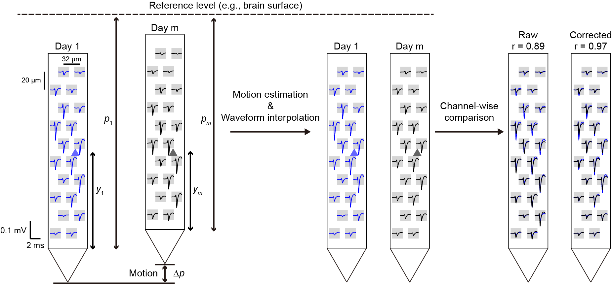
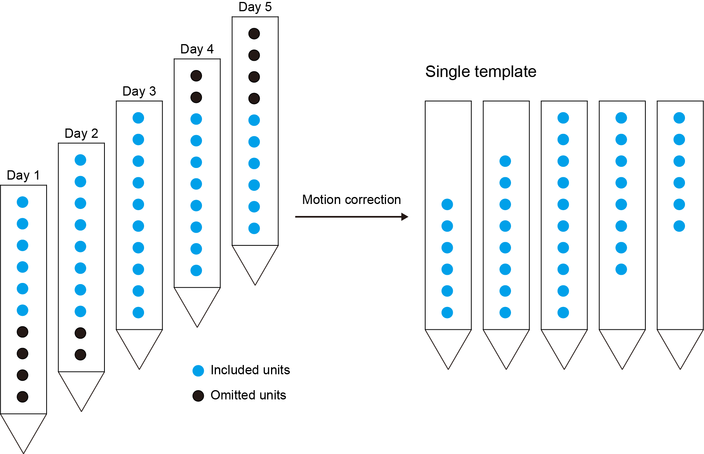
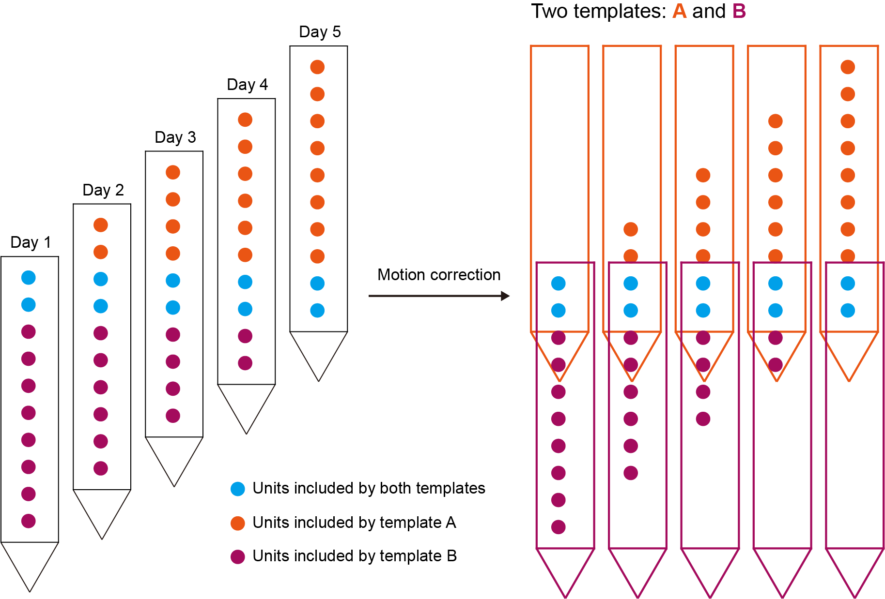
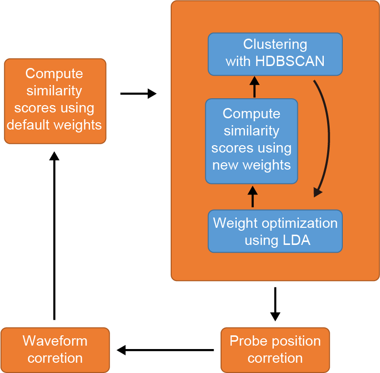
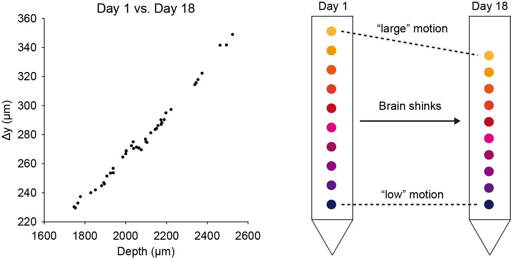
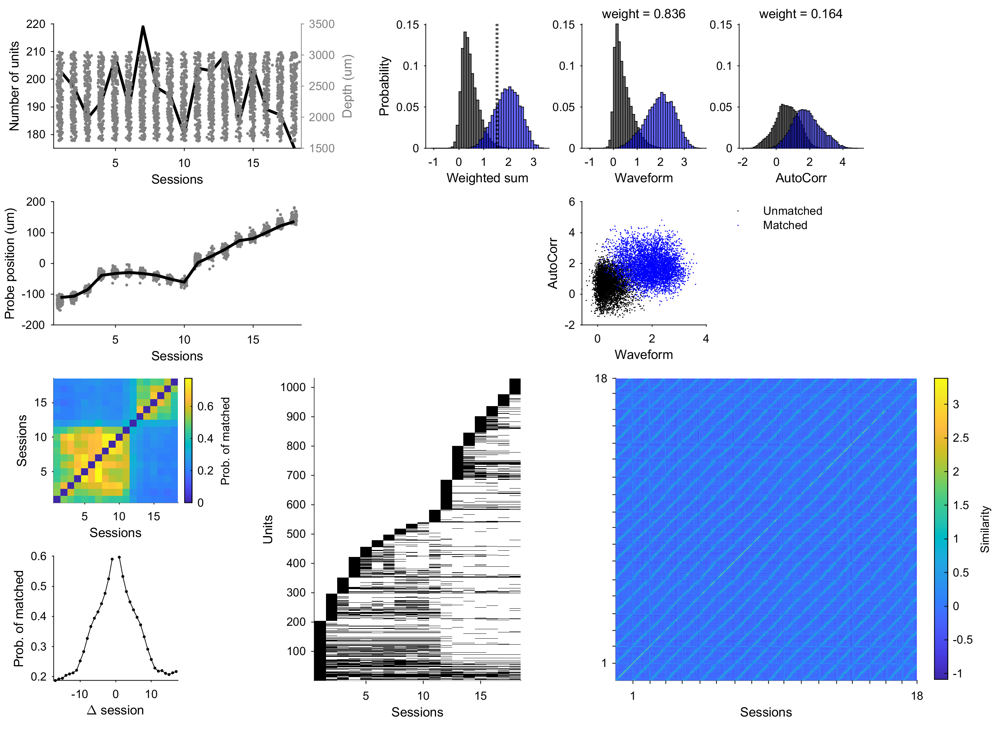
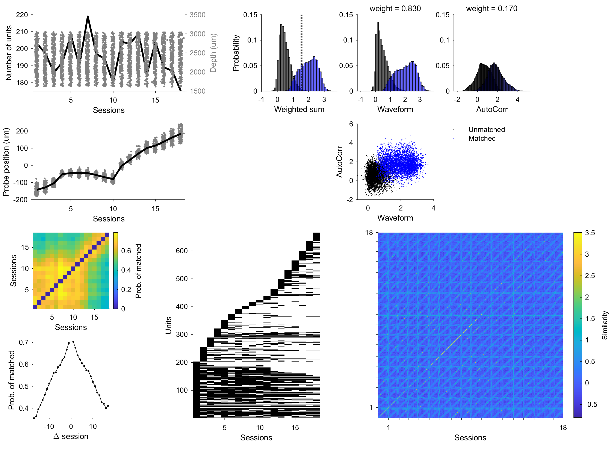
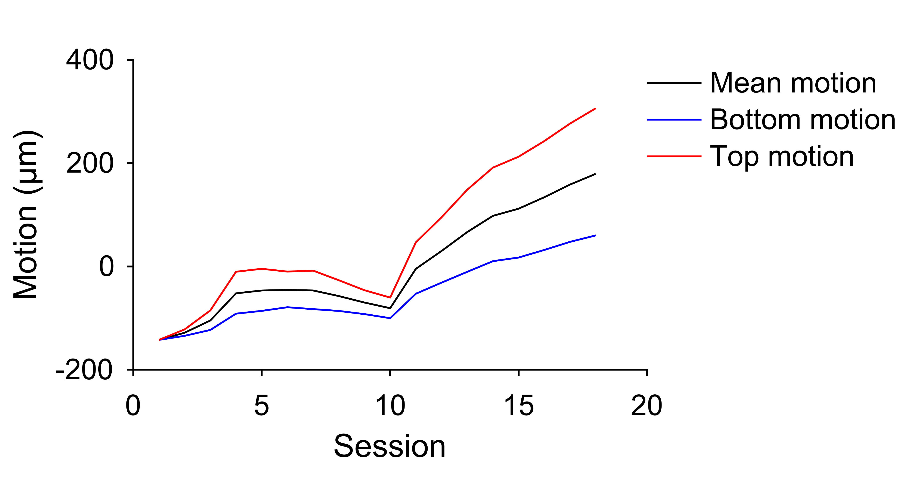

Motion correction
==================

Why motion correction
-------------------------

|

In chronic Neuropixels recordings, the probe is not stationary relative to the brain even if the probe base is tightly fixed to the skull [1]_. The probe displacements can be tens to hundreds of micrometers in weeks long recordings. The probe movement greatly affects the waveforms recorded on each channel site (15~20 μm interval along the probe). 

In the above figure, the probe move upwards from day 1 to day m, while the recorded neuron remains in the same location relative to the brain (the triangles). This motion causes changes in spike waveforms in the corresponding channel sites. The probe positions relative to the brain are denoted as :math:`p_1` and :math:`p_m` in day 1 and day m. And the unit locations relative to the probe tip are denoted as :math:`y_1` and :math:`y_m`, which can be computed via the waveform amplitudes in the nearby channels. Therefore, the real probe motion :math:`\Delta p` (namely :math:`p_m - p_1`) can be estimated using the unit motion :math:`y_m - y_1`. Using the first-day probe, we can estimate the day-m waveforms on each channel site by :ref:`Krigging interpolation <waveform_correction_label>`. In this way, we can compare the waveforms on the same probes (without motion) rather than moved probes. In channel-wise waveform correlation analysis, the corrected waveforms show a much higher correlation coefficient.

The detailed motion correction algorithm is as follows.

.. _unit_localization_label:

Unit localization
--------------------------

The method of localization of units is well described in Boussard, et al. [2]_. Each unit's 3D position is
denoted as {:math:`x`, :math:`y`, :math:`z`}. Channel positions {:math:`x_c`, :math:`y_c`} on the
probe plane adhere to SpikeGLX/Kilosort conventions, with :math:`z_c` set to
0. Using a monopolar current source model, we compute the position of
each unit via

.. math::

    \underset{x,y,z,\alpha}{\operatorname{argmin}} \sum_{c \in
    \mathcal{C}}\left(\operatorname{ptt}_{c}-\frac{\alpha}{\sqrt{\left(x-x_{c}\right)^{2}+\left(y-y_{c}\right)^{2}+z^{2}}}\right)^{2}

.

Here, :math:`\operatorname{ptt}_c` denotes the peak-to-trough amplitude on
channel :math:`c`. :math:`\mathcal{C}` denotes the channel indices of :math:`n` nearest
channels from the peak channel (the channel with maximum peak-to-trough
value). :math:`n` is 20 in this study. :math:`\alpha` represents the overall signal
magnitude in the model. The optimization is done by MATLAB function
lsqcurvefit. The position :math:`\boldsymbol{y}` for each unit is used for
estimating the motion of the probe.

.. _motion_estimation_label:

Motion estimation
--------------------------

Probe motion across recording sessions was estimated using matched unit pairs (identified by the clustering algorithm) and their localized spatial positions. Let :math:`N_s` be the total number of sessions, :math:`N_p` the number of matched unit pairs , and :math:`\boldsymbol{p}_s` the probe position for session :math:`s`. For the :math:`i`-th matched pair (:math:`i = 1, \dots, N_p`), let :math:`s_A^{i}` and :math:`s_B^{i}` denote the sessions from which the two matched units originate, with :math:`y_A^i` and :math:`y_B^i` representing their spatial positions along the probe. The probe positions :math:`\boldsymbol{p} = [p_1, \dots, p_{N_s}]` were estimated by solving:

.. math::

    \boldsymbol{p}^* = \underset{\boldsymbol{p}}{\arg\min} \sum_{i=1}^{N_p} [( y_A^i -y_B^i) - (p_{s_A^i} - p_{s_B^i} ) ]^2

.

This minimizes the discrepancy between the relative displacements of matched units and the inferred probe motion across sessions. The optimization was performed using MATLAB's ``fminunc``, and mean-subtracted probe positions (:math:`\boldsymbol{p}^* - \text{mean}(\boldsymbol{p}^*)`) were used for waveform correction to center displacements around a common reference. 

.. _waveform_correction_label:

Waveform correction
--------------------------

We applied Kriging interpolation method for motion correction, adapting
it to interpolate average waveforms instead of raw recordings. Corrected
waveforms :math:`\tilde{\mathbf{W}}` at probe position :math:`v = \{x, y\}` is the
weighted summation of the original waveforms :math:`\mathbf{W}`, weighted by
spatial proximity. The distance matrices between positions
:math:`\boldsymbol{v}_1` and :math:`\boldsymbol{v}_2` were defined as:

.. math::

    \mathbf{D}_x(\boldsymbol{v}_1,\boldsymbol{v}_2) = \lvert
    \boldsymbol{x}_{1}-\boldsymbol{x}^{T}_2 \rvert

and 

.. math::
    \mathbf{D}_y(\boldsymbol{v}_1,\boldsymbol{v}_2) = \lvert
    \boldsymbol{y}_{1}-\boldsymbol{y}^{T}_2 \rvert

,

where :math:`\mathbf{D}_x(\boldsymbol{v}_1,\boldsymbol{v}_2)` and
:math:`\mathbf{D}_y(\boldsymbol{v}_1,\boldsymbol{v}_2)` is the distance matrix
between positions :math:`\boldsymbol{v}_1` and positions :math:`\boldsymbol{v}_2` in
the x and y direction, respectively. Let
:math:`\boldsymbol{v_\mathcal{C}} = \{\boldsymbol{x_\mathcal{C}}, \boldsymbol{y_\mathcal{C}}\}`
denote the positions of the channels :math:`\mathcal{C}`. Then, the corrected
waveform :math:`\tilde{\mathbf{W}}` at probe position :math:`v` is computed via

.. math::
    
    K(\boldsymbol{v}_1,\boldsymbol{v}_2) =
    e^{-\frac{\mathbf{D}_x}{\sigma_x}-\frac{\mathbf{D}_y}{\sigma_y}}

and 

.. math::
    \tilde{\mathbf{W}}(v) =
    K(v,\boldsymbol{v_\mathcal{C}})K(\boldsymbol{v_\mathcal{C}},\boldsymbol{v_\mathcal{C}})^{-1}\mathbf{W}_\mathcal{C}

,

where :math:`K` is a generalized Gaussian kernel. :math:`\sigma_x` and :math:`\sigma_y`
are two parameters controlling the size of the kernel, with
:math:`\sigma_x = 20` and :math:`\sigma_y = 30` in this paper. For cross-session
consistency, all waveforms were aligned to the mean probe position
(reference probe). The corrected waveform :math:`\tilde{\mathbf{W}}` for unit
:math:`i` on the reference probe is

.. math::

    \tilde{\mathbf{W}^i}(\boldsymbol{v}_\mathcal{C}) = K(\boldsymbol{v_\mathcal{C}} - \{0, \boldsymbol{p}_{
    \boldsymbol{s}_i}
    \},\boldsymbol{v_\mathcal{C}})K(\boldsymbol{v_\mathcal{C}},\boldsymbol{v_\mathcal{C}})^{-1}\mathbf{W}_\mathcal{C}^i

.

Now, we can compute the corrected waveform similarity again as :ref:`before <waveform_similarity_label>`!

|

Wait! There is a problem with this method: the units on the edges will be ommited! The above method basically mapped all the units' waveforms to the same probe template and do comparison there. As shown in the figure, because the probe template will be set in the center position, the units on the edges (black dots) will not be included in the template. So, the matches provided by these units cannot be found!

|

To solve this issue, we can set 2 probe templates: one on the top and one at the bottom (see :ref:`here <n_templates_label>` for how to set the parameter). The ommited units by the template A (the purple dots) can be rescued by the template B, and vice versa. The waveform similarity by any two units will be the maximum value of the similarity on either probe. As the probe is far longer than the scale of motion, this method guarentees the inclusion of all recorded units.

.. _iterative_motion_correction_label:

Iterative motion correction
----------------------------------------------

|

Sometimes, one round of motion correction cannot reveal the real probe motion. It may be due to:

(1) Low number of matches found in the first round of motion correction. 
(2) Large probe motion and ineffectiveness of waveform feature.

Therefore, more rounds of motion correction could help. For the first case, simply do motion correction again and again. The matches found by the clustering algorithm will increase in each iteration and thus provide a more accurate result. For the second case, drop of waveform feature in the first round can estimate the probe motion better. The part in ``settings.json`` file is like:

.. code-block:: json

    "features": [
        ["AutoCorr", "PETH"],
        ["Waveform", "AutoCorr", "PETH"],
        ["Waveform", "AutoCorr", "PETH"]
    ] // features used for motion estimation each iteration. Choose from "Waveform", "AutoCorr", "ISI", "PETH"

.

Here, 3 rounds of motion correction will be done with ``AutoCorr`` and ``PETH`` features will be used in the first iteration. Single ``AutoCorr`` feature will probably work in high-quality datasets if the ``PETH`` feature is unavailable. Then, the ``Waveform`` features can work to get more matches for accurate motion esimation.

Empirically, 3 rounds of motion correction will be good and more iterations will not significantly provide better results. See :ref:`Change default settings <motion_correction_features_label>` for how to change it in ``settings.json``.

.. _non_rigid_correction_label:

Non-rigid motion correction
---------------------------

The rigid correction is not enough sometimes. Some datasets exhibit strong depth-dependent probe motion. Kilosort deal with this issue by setting "blocks". The probe is divided into multiple blocks and the motion correction is done individually in each block. This method does not suit well in neuron tracking problems as the unit distribution is not uniform along the probe. Some blocks may lack enough good units for accurate motion estimation. Then, how to solve this problem?

|

First, let's look at the matched pairs found by DANT with rigid motion correction. The displacements of these matched pairs are perfectly linearly correlated with the depth of these units (left side panel)! The difference of displacements is greater than 100 μm comparing the top region with the bottom region. It means that the brain shrinked significantly during this period (right side schematic).

Taken this linearity into consieration, we develop a new algorithm for non-rigid correction. Following the definition in :ref:`rigid motion estimation <motion_estimation_label>`, let's additionally define the depth :math:`d^i` for the :math:`i`-th matched pair via

.. math::

    d^i = \frac{y_A^i + y_B^i}{2}

.

And the new objective function will be 

.. math::

    \boldsymbol{k}^*, \boldsymbol{b}^* = \underset{\boldsymbol{k}, \boldsymbol{b}}{\arg\min} \sum_{i=1}^{N_p} [(y_A^i -y_B^i) - [(k_{s_A^i}d^i + b_{s_A^i}) - (k_{s_A^i}d^i + b_{s_B^i}) ] ]^2

.

Note that the function collapses to rigid motion correction if we set :math:`k` to 0 in all sessions. To correctly minimize the function, :math:`k_1` is set to 0, assuming no shrinkage on the first session. Again, :math:`\boldsymbol{b}^*` is mean substracted via

.. math::

    \boldsymbol{b}^* = \boldsymbol{b}^* - \text{mean}(\boldsymbol{k}^*\bar{d}+\boldsymbol{b}^*)

, where

.. math::

    \bar{d} = \frac{1}{N_p}\sum_{i}^{N_p}d^i

.

Instead of direct readout of the probe position in the rigid case, now the probe position :math:`p^i(d)` at the depth :math:`d` in session :math:`i` can be computed via

.. math::

    p^i(d) = k^*_id + b^*_i

.

Then, the :ref:`waveform correction <waveform_correction_label>` step performs similarily in the rigid case. The corrected waveform :math:`\tilde{\mathbf{W}}` for unit :math:`i` on the reference probe is

.. math::

    \tilde{\mathbf{W}^i}(\boldsymbol{v}_\mathcal{C}) = K(\boldsymbol{v_\mathcal{C}} - \{0, \boldsymbol{p}_{
    \boldsymbol{s}_i}
    \},\boldsymbol{v_\mathcal{C}})K(\boldsymbol{v_\mathcal{C}},\boldsymbol{v_\mathcal{C}})^{-1}\mathbf{W}_\mathcal{C}^i

,

where the :math:`\boldsymbol{p}_{\boldsymbol{s}_i}` now is computed via

.. math::

    \boldsymbol{p}_{\boldsymbol{s}_i} = k^*_{\boldsymbol{s}_i}y^i + b^*_{\boldsymbol{s}_i}

.

Although non-linearity exists and the cause of the non-rigid motion is not clear, this method works to better correct the probe motion. Please be careful to utilize non-rigid correction for this method can be unstable with low-quality dataset due to overfitting. See :ref:`here <non_rigid_correction_setting_label>` for how to turn on/off non-rigid motion correction in ``settings.json``.

Here is a comparison of the clustering results with / without non-rigid correction.

**Rigid**:

**Non-rigid**:

Although these two methods found similar mean probe motion across sessions, the non-rigid correction found inconsistent motion between the top and the bottom regions of the probe, which helped to find much more matches across sessions.

References
------------

.. [1] Steinmetz, Nicholas A., Cagatay Aydin, Anna Lebedeva, Michael Okun, Marius Pachitariu, Marius Bauza, Maxime Beau, et al. “Neuropixels 2.0: A Miniaturized High-Density Probe for Stable, Long-Term Brain Recordings.” Science 372, no. 6539 (April 16, 2021): eabf4588. https://doi.org/10.1126/science.abf4588.

.. [2] Boussard, Julien, Erdem Varol, Hyun Dong Lee, Nishchal Dethe, and Liam Paninski. “Three-Dimensional Spike Localization and Improved Motion Correction for Neuropixels Recordings.” In Advances in Neural Information Processing Systems, 34:22095-105. Curran Associates, Inc., 2021. https://proceedings.neurips.cc/paper/2021/hash/b950ea26ca12daae142bd74dba4427c8-Abstract.html.

